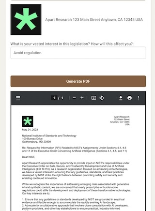

# Public Comment PDF Generator

## Overview
This application was developed during the Apart Research AI x Governance hackathon to demonstrate vulnerabilities in the public comment system on legislative documents from federalregister.gov. It shows how easily one can generate authentic-looking public comments that could complicate the policymaking process by requiring verification.

## Purpose
The project exposes how AI can manipulate democratic processes, particularly through the automation of public comments, highlighting the need for protective measures in democratic systems.

## Hackathon Context
Created in a weekend for the Apart Research AI x Governance hackathon, this project explores the intersection of AI and public governance. More about the hackathon can be found [here](https://www.apartresearch.com/post/join-ai-democracy).

<video width="640" height="480" controls>
  <source src="media/side-by-side-demo-small.mp4" type="video/mp4">
  Your browser does not support the video tag.
</video>

## Features
- **Document Retrieval and Summarization**: Fetches and summarizes Federal Registry documents using the Claude API with the Haiku model.
- **Logo Acquisition**: Uses the Clearbit API to retrieve official company logos.
- **Dynamic PDF Generation**: Creates structured PDFs that include user inputs, document summaries, and logos.

## Technology Stack
- **Frontend**: React.js
- **APIs**:
  - **Claude API with Haiku Model**: For summarizing documents and generating content.
  - **Clearbit API**: For obtaining company logos.
- **Hosting**: Vercel

## Rationale for Demonstrating Risks to Democracy
This project illustrates the potential for AI to disrupt democratic processes and emphasizes the urgent need for developing strategies to counteract these risks. The simulation aims to inform policymakers and stakeholders, guiding the development of AI governance frameworks to maintain societal stability.
